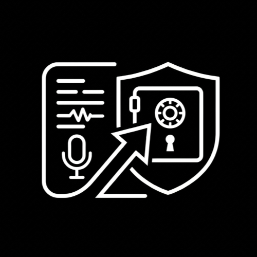

<p align="center">
  
</p>

# Transcribe To Vault — Chrome Extension

[](https://chromewebstore.google.com/detail/bocbdmbaeekeaelafgjnfoohnedmgihe?utm_source=item-share-cb)

A Chrome extension that automatically summarizes Udemy lecture transcripts using any LLM and saves structured notes directly into your Obsidian vault.

---

## What It Does

When watching a Udemy course, open the extension popup and click **"Save Note"** to:

1. Extract the lecture transcript from the current page
2. Send it to your configured LLM (Ollama, OpenAI, Gemini, Anthropic, etc.)
3. Save the AI-generated summary as a Markdown file into a chosen Obsidian folder

You stay in control: you click the button intentionally, so demo or irrelevant lectures are skipped.

---

## Prerequisites

### Obsidian Local REST API Plugin

1. Open Obsidian → Settings → Community Plugins → Browse
2. Search for **"Local REST API"** and install it
3. Enable the plugin
4. Note the API key shown in plugin settings (add it to extension settings)
5. The plugin listens on `http://localhost:27123` by default

### For Ollama (local LLM)

```bash
ollama pull llama3
OLLAMA_ORIGINS="*" ollama serve
```

### For cloud LLMs (OpenAI, Gemini, Anthropic)

Just add your API key in the extension Settings tab.

---

## Development

```bash
npm install
npm run build
```

Load the `dist/` folder in Chrome:

- `chrome://extensions` → Enable Developer Mode → Load unpacked → select `dist/`

---

## User Flow

```
1. Open Udemy lecture
2. Click extension icon
3. (First time) Go to Settings → set LLM + Obsidian folder
4. Click "Save Note" on any lecture you want to capture
5. Note appears in Obsidian at {folder}/{lecture-title}.md
6. Change folder in popup when moving to a new course section
```

---

## Roadmap

- [x] Phase 1: Obsidian Local REST API integration
- [x] Phase 2: Folder picker with persistent storage
- [x] Phase 3: Multi-LLM support (Ollama, OpenAI, Gemini, Anthropic)
- [x] Phase 4: Customizable prompt template
- [ ] Phase 5 (future): Auto-detect section from Udemy DOM and suggest folder name
- [ ] Phase 5 (future): Note history / re-summarize with different LLM
